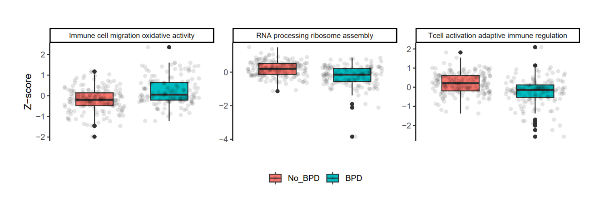

The calculate_avg_expression_nested function performs a comprehensive analysis pipeline
designed for weighted gene co-expression network analysis (WGCNA), followed by 
Gene Ontology (GO) enrichment analysis, and the calculation of pathway-level expression
averages. This function is particularly useful for identifying biologically relevant pathways
and their associated gene expression patterns across different sample groups or conditions.

Input data is an already normalized and/or batch corrected gene expression matrix. This function can be modified to apply normalization step on raw transcriptomic data and further be customized for other omic studies. 

Key steps involved in this analysis include:
1. WGCNA Analysis: This function utilizes the blockwiseModules function from the WGCNA package
   to construct a gene co-expression network, identify gene modules, and assign cluster labels
   based on co-expression patterns. This step ensures the identification of biologically
   meaningful clusters of genes that exhibit similar expression trends. 
2. Gene Ontology (GO) Enrichment Analysis: After identifying gene clusters, the function performs GO enrichment analysis using the enricher function from the clusterProfiler package. This analysis
helps to identify over-represented biological processes (GO terms) within each gene cluster.
3. Top 20 Pathways Identification: For each identified gene cluster, the function retrieves the top
   20 enriched pathways, focusing on GOBP categories. This allows for the identification of the most
   biologically significant pathways associated with the gene clusters.
4. Pathway-level Expression Averaging: Calculates the average gene expression for each pathway
   (or entire pathway expression) by extracting the relevant genes from the gene expression matrix,
   providing a pathway-level expression score. This enables the comparison of pathway activity
   across samples, treatments, or data sets.
5. Results: Output is a list containing the average expression values for each pathway within each gene cluster, along with the associated GO enrichment results.

The plot represents what can be created after using this function. Genes are clustered based on their co-expression patterns, then a pathwway enrichment analysis is performed on those clusters allowing for explicit selection of genes belonging to those pathways to be evaluated in groups of interest. 
